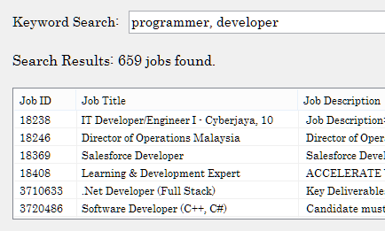
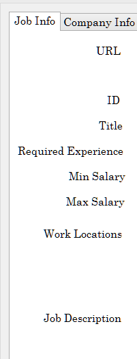

# JOADFIAN
JOADFIAN, short for *Job Advertising Filtering and Analysis*, is an application for analysing job advertisements on Jobstreet.com. 
Written for a university project, one of the main goals of this application was to determine the most popular programming languages in Malaysia. 

Jobstreet's policy prevents its users from sharing its data with others via an online medium. 
Therefore, the original data used for analysis purposes has been removed. 
The installer has also been removed because it includes the original data. 
The web scraper used for obtaining the data is not provided due to terms of service.
This application was only uploaded to GitHub to illustrate the code used to develop it.

The application was developed using Visual Studio 2017 in C#. It has only been tested in Windows platforms.

# Getting Started
  
1. Run the application via the executable file. It is called `Joadfian.exe`, and can be found here: `JOADFIAN/Joadfian/bin/Release/`. 

2. If the computer is on Windows 10, Windows Defender may issue a warning due to the program being from an Unknown Publisher.
This message can be safely ignored.

# Features

Here are a few examples of what the application can do when there is actual data in the database. 
Note that there were several features planned for the application that were not implemented due to time constraints.

**1. Search for all jobs containing specific words in title, description and other fields in the database.**

**2. Display all available data for a specific advertisement when double clicked on. (Data not shown in image)**

**3. Count the most commonly used words in the job titles and job descriptions of advertisements that match the search criteria.**

**4. Count the number of advertisements that use a specific word or phrase in their job titles and job descriptions.**

# Concluding Thoughts

Using a sample of 25,000 jobs obtained from Jobstreet.com in 2018, which is approximately three months of job posting, 
the application was able to provide some insight on the most popular programming languages in Malaysia. 
Java, C#, VB.NET and JavaScript in particular were high on the list. 

The results are far from conclusive, as the sample data was only over taken over a period of three months. 
Moreover, certain features were not implemented in the software to allow it to make finer distinctions where necessary.
For example, the word count features cannot differentiate between `Java` and `JavaScript` or `Java Script`.
It is also unable to detect when `C` refers to the programming language and vice versa. 
Furthermore, the result is only limited to jobs posted on Jobstreet.com, which does not represent the whole population of jobs available in the marketplace.
Nonetheless, the program provided sufficient information for its original purpose.

As of now, there are no plans to extend the development of this project.

# License

This application is licensed under GNU GPLv3. 

**Disclaimer**

This application was written for educational purposes. The author is not responsible for any charges that is incurred 
as a result of using the software.
